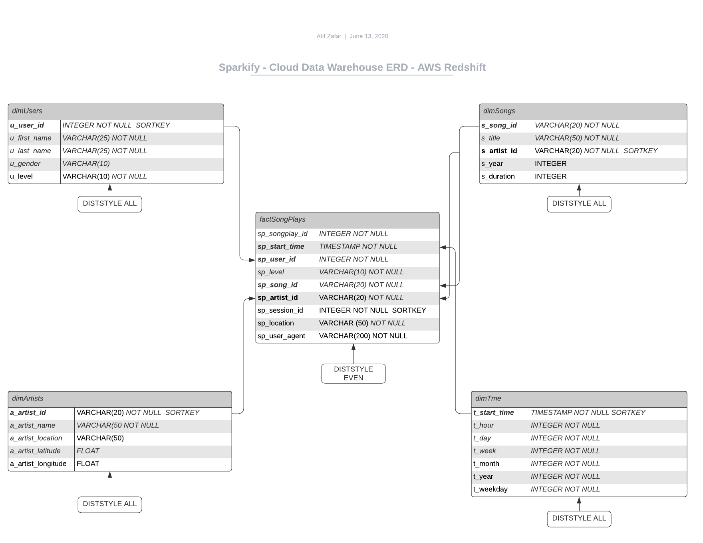

### Introduction
A music streaming startup, Sparkify, has grown their user base and song database and want to move their processes and data onto the cloud. Their data resides in S3, in a directory of JSON logs on user activity on the app, as well as a directory with JSON metadata on the songs in their app.

As their data engineer, you are tasked with building an ETL pipeline that extracts their data from S3, stages them in Redshift, and transforms data into a set of dimensional tables for their analytics team to continue finding insights in what songs their users are listening to. You'll be able to test your database and ETL pipeline by running queries given to you by the analytics team from Sparkify and compare your results with their expected results.

### Project Description
In this project, I have applied my knowledge on data warehouses and AWS to build an ETL pipeline for a database hosted on Redshift. I loaded the data from S3 to staging tables on Redshift and execute SQL statements that create the analytics tables from these staging tables.

#### Create Table Schemas
1. Schema for your fact and dimension tables is below in Star Schema 2NF

##### Fact Table
1. songplays - records in event data associated with song plays i.e. records with page NextSong
  * songplay_id, start_time, user_id, level, song_id, artist_id, session_id, location, user_agent

#### Dimension Tables
1. users - users in the app
  * user_id, first_name, last_name, gender, level

2. songs - songs in music database
  * song_id, title, artist_id, year, duration

3. artists - artists in music database
  * artist_id, name, location, lattitude, longitude

4. time - timestamps of records in songplays broken down into specific units
  * start_time, hour, day, week, month, year, weekday

2. Wrote SQL CREATE statements for each of these tables in sql_queries.py
3. Completed the logic in create_tables.py to connect to the database and create these tables
4. Wrote SQL DROP statements to drop tables in the beginning of create_tables.py if the tables already exist. This way, I ran create_tables.py whenever I want to reset the database and test the ETL pipeline.
5. Launched a redshift cluster and create an IAM role that has read access to S3.
6. Added redshift database and IAM role info to dwh.cfg.
7. Tested by running create_tables.py and checking the table schemas in your redshift database. 
You can use Query Editor in the AWS Redshift console for this.

#### ETL Pipeline
1. Implemented the logic in etl.py to load data from S3 to staging tables on Redshift.
2. Implemented the logic in etl.py to load data from staging tables to analytics tables on Redshift.
3. Tested by running etl.py after running create_tables.py and running the analytic queries on the Redshift database to compare the results with the expected results.
4. Deleted the redshift cluster when finished.

-------------------------------------------------------------------------

#### How to run
The data-sources are provided by two [``S3 buckets``](https://aws.amazon.com/en/s3/) 
You need a [``AWS Redshift Cluster``](https://aws.amazon.com/en/redshift/) up and running

And  [Python](https://www.python.org/downloads/)  

* Redshift ``dc2.large``  cluster with <b> 4 nodes </b> was used with a costing ``USD 0.25/h (on-demand option)`` per cluster
* We used [``IAM role ``](https://docs.aws.amazon.com/en_us/IAM/latest/UserGuide/id_roles.html) authorization mechanism, 
* The only policy attached to this IAM is [``AmazonS3ReadOnlyAccess``](https://aws.amazon.com/en/blogs/security/organize-your-permissions-by-using-separate-managed-policies/)
* Make sure sure Redshift is has public access and VPC Secuirty Group Access.  

In termina, set your filesystem on project root folder  
and  insert the commands to run:   
<I> the Creating the Redshift tables </I>  
`` python create_tables.py``  

<I> Next, insert data into the Redshift using the ETL Script </I>  
`` python etl.py``  

--------------------------------------------

#### Project structure
``/``  
means its in the main folder:

* <b> /Data </b> - Folder to store data and ERD images``md``
* <b> create_tables.py </b> - drops old tables (if exist) ad creates/recreates new tables
* <b> etl.py </b> - Inserts JSON data into the tables in Redshift from S3 t
* <b> sql_queries.py </b> - SQL statements using Python,  for CREATE, DROP, COPY and INSERT tables
* <b> dhw.cfg </b> - Info about Redshift, IAM and S3 (hidden)
_________________________________________________________________

#### References

* https://github.com/FedericoSerini/DEND-Project-3-Data-Warehouse-AWS/
* https://github.com/janjagusch/dend-03-data-warehouse

