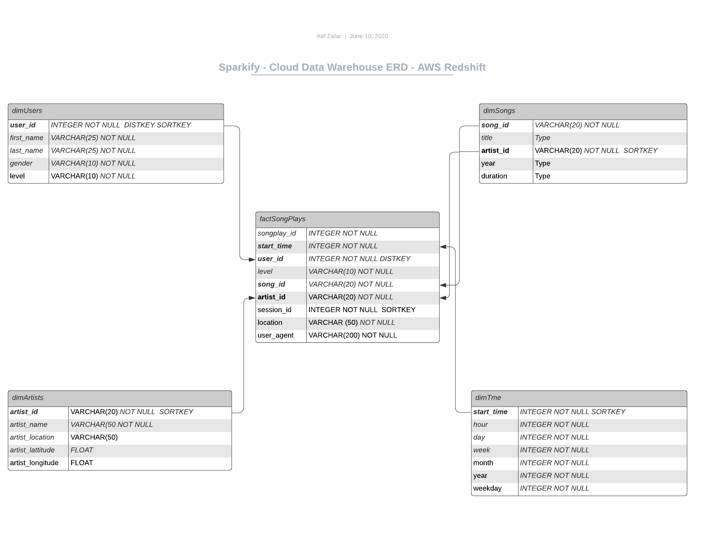

### Introduction
A music streaming startup, Sparkify, has grown their user base and song database and want to move their processes and data onto the cloud. Their data resides in S3, in a directory of JSON logs on user activity on the app, as well as a directory with JSON metadata on the songs in their app.

As their data engineer, you are tasked with building an ETL pipeline that extracts their data from S3, stages them in Redshift, and transforms data into a set of dimensional tables for their analytics team to continue finding insights in what songs their users are listening to. You'll be able to test your database and ETL pipeline by running queries given to you by the analytics team from Sparkify and compare your results with their expected results.

### Project Description
In this project, you'll apply what you've learned on data warehouses and AWS to build an ETL pipeline for a database hosted on Redshift. To complete the project, you will need to load data from S3 to staging tables on Redshift and execute SQL statements that create the analytics tables from these staging tables.

### Project Steps
Below are steps you can follow to complete each component of this project.

#### Create Table Schemas
1. Design schemas for your fact and dimension tables
##### Fact Table
1. songplays - records in event data associated with song plays i.e. records with page NextSong
  * songplay_id, start_time, user_id, level, song_id, artist_id, session_id, location, user_agent

#### Dimension Tables
1. users - users in the app
  * user_id, first_name, last_name, gender, level

2. songs - songs in music database
  * song_id, title, artist_id, year, duration

3. artists - artists in music database
  * artist_id, name, location, lattitude, longitude

4. time - timestamps of records in songplays broken down into specific units
  * start_time, hour, day, week, month, year, weekday

2. Write a SQL CREATE statement for each of these tables in sql_queries.py
3. Complete the logic in create_tables.py to connect to the database and create these tables
4. Write SQL DROP statements to drop tables in the beginning of create_tables.py if the tables already exist. This way, you can run create_tables.py whenever you want to reset your database and test your ETL pipeline.
5. Launch a redshift cluster and create an IAM role that has read access to S3.
6. Add redshift database and IAM role info to dwh.cfg.
7. Test by running create_tables.py and checking the table schemas in your redshift database. You can use Query Editor in the AWS Redshift console for this.

#### Build ETL Pipeline
1. Implement the logic in etl.py to load data from S3 to staging tables on Redshift.
2. Implement the logic in etl.py to load data from staging tables to analytics tables on Redshift.
3. Test by running etl.py after running create_tables.py and running the analytic queries on your Redshift database to compare your results with the expected results.
4. Delete your redshift cluster when finished.

#### Document Process
Do the following steps in your README.md file.

1. Discuss the purpose of this database in context of the startup, Sparkify, and their analytical goals.
2. State and justify your database schema design and ETL pipeline.
3. [Optional] Provide example queries and results for song play analysis.
